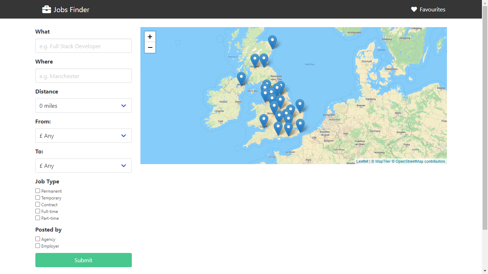

# Jobs Finder

This project is a job finder web app.
Live demo [_here_](https://aidkool.github.io/jobs-finder/). 

## Table of Contents
* [General Info](#general-information)
* [Technologies Used](#technologies-used)
* [Features](#features)
* [Screenshots](#screenshots)
* [Setup](#setup)
* [Usage](#usage)
* [Project Status](#project-status)
* [Room for Improvement](#room-for-improvement)
* [Acknowledgements](#acknowledgements)
* [Contact](#contact)
<!-- * [License](#license) -->

## General Information

The purpose of this app is so user clients can: 

- Fill out a form with criteria of the type of job they are looking for.
- Once the form has been submitted the user will be provided with all available jobs matching their search criteria.
- Job cards will be displayed showing the company name, location, salary and a brief description.
- The user can then click on the job title and a modal will pop up showing the full details of the job.
- If a user likes a job they can save it via local storage and it will be rendered on the favourites page.
- The app also has a interactive map that provides wellbeing statistics for some cities in the UK. 

## Technologies Used
- Third Party APIs
- JavaScript
- CSS
- HTML

For further information on the used API's, please check:

- https://www.reed.co.uk/api/
- https://api.maptiler.com
- https://developer.myptv.com/APIs/Geocoding%20&%20Places.htm
- https://developer.ons.gov.uk/

## Screenshots

## Setup
-Text editor (VS Code recommended)
-An Internet browser (Google Chrome recommended)

## Project Status
Project is: complete.

## Acknowledgements
- https://www.reed.co.uk/api/
- https://api.maptiler.com
- https://developer.myptv.com/APIs/Geocoding%20&%20Places.htm
- https://developer.ons.gov.uk/

## Contact
Created by -[@AidKool](https://github.com/AidKool)
           -[@moedaaboul](https://github.com/moedaaboull) 
           -[@Iler22](https://github.com/Iler22) 

- feel free to contact us!

## ONS Questions

Source: Annual Population Survey, Office for National Statistics									
									
1. Question: Overall, how satisfied are you with your life nowadays? Where 0 is 'not at all satisfied' and 10 is 'completely satisfied'.

2. Question: Overall, to what extent do you feel the things you do in your life are worthwhile?  Where 0 is 'not at all worthwhile' and 10 is 'completely worthwhile'.	

3. Question: Overall, how happy did you feel yesterday? Where 0 is 'not at all happy' and 10 is 'completely happy'.	

4. Question: Overall, how anxious did you feel yesterday? Where 0 is 'not at all anxious' and 10 is 'completely anxious'.									

