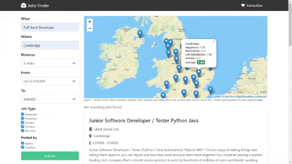

# Jobs Finder

This project is a job finder web app.
Live demo [_here_](https://aidkool.github.io/jobs-finder/).

## Table of Contents

- [General Info](#general-information)
- [Technologies Used](#technologies-used)
- [Features](#features)
- [Appearance](#appearance)
- [ONS survey questionnaire](#ons-survey-questionnaire)
- [Wellbeing average methodology](#wellbeing-average-methodology)
- [Setup](#setup)
- [Project Status](#project-status)
- [Demo](#demo)
- [Acknowledgements](#acknowledgements)
- [Contact](#contact)

## General Information

The purpose of this app is so user clients can:

- Fill out a form with criteria of the type of job they are looking for, which includes job title (or keywords), job location, distance, starting salary, maximum salary, job type (i.e. permanent, temproary, contract, full-time, part-time) and whether the job was posted by an agency or the employer.
- Once the form has been submitted the user will be provided with the number of available jobs matching their search criteria.
- Upon submission, 5 job cards will be rendered on each screen. The user will be able to navigate through the pages through pagination.
- Job cards will be displayed showing the company name, location, salary and a brief description.
- Upon clicking the job card header, a modal will pop up showing the full details of the job.
- Once a user likes a job, it will be saved in local storage and rendered on the favourites page. Likewise, if the user unlikes a job it will be removed from local storage and no longer rendered on the favourites page.
- Upon display, the app provides an interactive map that provides recent wellbeing statistics from the ONS for a number of cities in the UK from the FY20-21 wellbeing survey.

## Technologies Used

- Reed Job Seeker's APIs
- Office of National Statistics (ONS) API
- MYPTV API
- Map Tiler API
- Leaflet JS library
- Bulma framework
- Font Awesome
- Formspree
- JavaScript
- HTML
- CSS

For further information on the used technologies, please visit:

- https://www.reed.co.uk/api/
- https://developer.ons.gov.uk/
- https://developer.myptv.com/APIs/
- https://api.maptiler.com
- https://leafletjs.com/
- https://bulma.io/
- https://formspree.io/
- https://developer.mozilla.org/en-US/docs/Web/JavaScript
- https://developer.mozilla.org/en-US/docs/Web/HTML
- https://developer.mozilla.org/en-US/docs/Web/CSS

## Features

The app also has additional feautures:

- If no jobs are saved in favourites an image gets displayed in the favourites page which conveys that no jobs have been saved yet in favourites.
- Heartbeat animation effect upon hover on buttons that embed the font-awesome heart icon.
- A footer with attributions to sources and technologies utilised.
- Animation effects on social media icons
- A contact page powered by Formspree.

## Appearance

## ONS survey questionnaire

Source: Annual Population Survey, Office for National Statistics

1. Question related to the life-satisfaction wellbeing factor: Overall, how satisfied are you with your life nowadays? Where 0 is 'not at all satisfied' and 10 is 'completely satisfied'.

2. Question related to the worthwhile wellbeing factor: Overall, to what extent do you feel the things you do in your life are worthwhile? Where 0 is 'not at all worthwhile' and 10 is 'completely worthwhile'.

3. Question related to the happiness wellbeing factor: Overall, how happy did you feel yesterday? Where 0 is 'not at all happy' and 10 is 'completely happy'.

4. Question related to the anxiety wellbeing factor: Overall, how anxious did you feel yesterday? Where 0 is 'not at all anxious' and 10 is 'completely anxious'.

## Wellbeing average methodology

We have calculated the average score as rendered on the map popups as the weighted average of all of the four factor scores by taking the actual score of all of the top 3 factors (i.e. happiness, life-satisfaction, worthwhile) and the reverse scale value of the anxiety factor.

## Setup

-Text editor (VS Code recommended)
-An Internet browser (Google Chrome recommended)

## Project Status

Project is: complete.

## Demo

## Acknowledgements

- https://www.reed.co.uk/api/
- https://developer.ons.gov.uk/
- https://api.maptiler.com
- https://developer.myptv.com/APIs
- https://leafletjs.com/
- https://bulma.io/
- https://formspree.io/

## Contact

Created by -[@AidKool](https://github.com/AidKool) -[@moedaaboul](https://github.com/moedaaboull) -[@Iler22](https://github.com/Iler22)

- Feel free to contact us!
